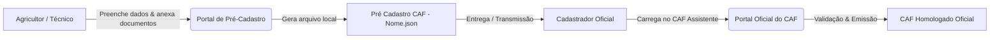

# 🌱 Sistema de Pré-Cadastro e Assistente Inteligente do CAF

Solução completa para coleta, validação prévia e automação no preenchimento do **Cadastro Nacional da Agricultura Familiar (CAF)**, composta por:
1. **Portal Web de Pré-Cadastro:** Formulário para agricultores e técnicos coletarem e estruturarem as informações da Unidade Familiar de Produção Agrária (UFPA).
2. **CAF Assistente (Userscript Tampermonkey):** Painel inteligente para cadastradores oficiais automatizarem a inserção dos dados diretamente no sistema oficial do Governo Federal.

---

## 📌 Sobre o Projeto

O sistema foi desenvolvido para agilizar o atendimento e eliminar a digitação manual repetitiva no portal oficial do CAF. O agricultor ou técnico preenche previamente os dados e notas fiscais na página web, gerando um arquivo estruturado em formato `.json`. Em seguida, o **cadastrador oficial** utiliza o **CAF Assistente** no navegador para carregar o arquivo e preencher os formulários oficiais com apenas alguns cliques.

> [!IMPORTANT]
> **Natureza Preparatória:** O preenchimento do formulário web constitui uma etapa preparatória de pré-cadastro. Ele **não substitui, não homologa e não emite o CAF oficial**, que é emitido exclusivamente por um cadastrador credenciado e autorizado no sistema oficial do Governo Federal.

---

## 🚀 Fluxo Geral de Funcionamento

---

## 🤖 Guia do Cadastrador: Como Utilizar o CAF Assistente

O **CAF Assistente** é um userscript executado diretamente no navegador pelo cadastrador oficial através da extensão **Tampermonkey**.

### 1. Instalar a Extensão Tampermonkey
Instale a extensão no seu navegador de preferência:
* [Tampermonkey para Google Chrome](https://chromewebstore.google.com/detail/tampermonkey/dhdgffkkebhmkfjojejmpbldmpobfkfo)
* [Tampermonkey para Microsoft Edge](https://microsoftedge.microsoft.com/addons/detail/tampermonkey/iikmkjmpaadaobahmlepeloendndfphd)
* [Tampermonkey para Mozilla Firefox](https://addons.mozilla.org/pt-BR/firefox/addon/tampermonkey/)

---

### 2. Instalar o Script `CAF_Assistente_V5_Pronto.js`
1. Abra o arquivo [`CAF_Assistente_V5_Pronto.js`](CAF_Assistente_V5_Pronto.js) aqui no repositório.
2. Clique no botão **Raw** (ou selecione e copie todo o código).
3. Abra o ícone do **Tampermonkey** no navegador e clique em **Criar novo script...** (ou *Dashboard* ➔ *+*).
4. Cole o código copiado, substituindo qualquer texto existente, e pressione `Ctrl + S` para salvar.

---

### 3. Utilizar no Portal Oficial do CAF
1. Acesse o sistema oficial do CAF: [https://caf.mda.gov.br/](https://caf.mda.gov.br/) (ou portal correspondente).
2. O **CAF Assistente** aparecerá como um **painel inteligente flutuante** no canto inferior direito da tela.
3. Clique em **Carregar JSON** no assistente e selecione o arquivo `Pré Cadastro CAF - [Nome].json` fornecido pelo agricultor.
4. **Navegue pelas abas do CAF** e utilize os botões automáticos do painel:
   * 👥 **Aba 1 (Pessoas / Membros):** Preenche os dados do titular e dependentes, com acionamento automático da consulta à Receita Federal e seleção precisa de dados sociodemográficos.
   * 📍 **Aba 2 (Endereço):** Preenche CEP, UF, Município, Logradouro, Bairro e opções de número.
   * 🏞️ **Aba 3 (Áreas e Imóveis):** Preenche as áreas com conversão decimal precisa (hectares), dados de proprietário, coordenadas geográficas e anexa automaticamente o PDF comprobatório armazenado no JSON.
   * 🚜 **Aba 4 (Mão de Obra):** Insere os trabalhadores permanentes e temporários contratados.
   * 🌾 **Aba 5 (Renda e Produção):** Consolida e preenche a tabela de produção a partir das notas fiscais processadas.
5. **Edição Rápida:** Caso precise corrigir algum dado durante o atendimento, clique no botão **Editar** no assistente para abrir o formulário com os dados carregados e sincronizar as alterações instantaneamente.

---

## 🔒 Privacidade, Armazenamento Local e LGPD

* **Processamento 100% Local:** Todos os dados digitados e arquivos anexados são armazenados **localmente no dispositivo** (`localStorage`).
* **Sem Envio para Servidores Externos:** O sistema não realiza transmissões automáticas para bancos de dados na nuvem.
* **Segurança do Arquivo:** O arquivo JSON contém dados pessoais e cópias de documentos anexados em formato seguro (Base64). Deve ser mantido em local seguro e compartilhado exclusivamente para a finalidade do cadastro oficial.
* **LGPD (Lei nº 13.709/2018):** O tratamento dos dados destina-se estritamente à preparação e realização do CAF, observando os princípios de transparência, necessidade e segurança da informação.

---

## 📋 Estrutura dos Módulos do Formulário

* **1. Membros da Família:** Identificação do titular e dos demais integrantes da UFPA (CPF, Nascimento, Sexo, Identidade de Gênero, Estado Civil, Cor/Raça, Escolaridade, UF/Município de Nascimento, Parentesco, Trabalho na UFPA, Telefone e Documentos).
* **2. Endereço da UFPA:** Localização do estabelecimento principal com busca automática por CEP (ViaCEP) e padronização oficial de UFs e Municípios.
* **3. Áreas e Imóveis Rurais:** Condição de posse, tipo de área, tamanho em hectares/m³, dados do proprietário, coordenadas geográficas e anexo de documento comprobatório em PDF.
* **4. Mão de Obra na UFPA:** Cadastro de trabalhadores permanentes ou temporários (homem/dia).
* **5. Renda da Propriedade e Documentos Fiscais:** Upload de DANFEs em PDF, importação de chaves de acesso da NF-e e síntese dinâmica da produção comercializada.
* **Declaração, Ciência e Proteção de Dados:** Termo de veracidade (Art. 299 CP) e ciência sobre uso dos dados com modal de confirmação prévia.

---

## 🛠️ Tecnologias Utilizadas

* **HTML5 / CSS3 Moderno** (Interface responsiva e acessível)
* **JavaScript (Vanilla)** (Processamento client-side, manipulação de DOM e integração Tampermonkey)
* **[PDF.js](https://mozilla.github.io/pdf.js/)** (Leitura e extração local de dados de DANFEs em PDF)
* **[ViaCEP](https://viacep.com.br/)** (Consulta de endereços por CEP)
* **[Font Awesome](https://fontawesome.com/)** (Iconografia)

---

## 👨‍💻 Desenvolvedor

**João Vitor Toledo**  
*Engenheiro Agrônomo, Mestre em Produção Vegetal, Doutor em Meteorologia Agrícola*  
GitHub: [@jvitoragr](https://github.com/jvitoragr)

---

## 📄 Licença

Este projeto é disponibilizado para fins de suporte, facilitação e atendimento à agricultura familiar.
