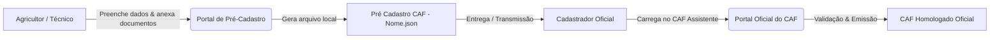

# 🌱 Sistema de Pré-Cadastro e Assistente Inteligente do CAF

Solução completa para coleta, validação prévia e automação no preenchimento do **Cadastro Nacional da Agricultura Familiar (CAF)**, composta por:
1. **Portal Web de Pré-Cadastro:** Formulário para agricultores e técnicos coletarem, conferirem e estruturarem as informações da Unidade Familiar de Produção Agrária (UFPA).
2. **CAF Assistente (Extensão de Navegador & Userscript):** Painel inteligente para cadastradores oficiais automatizarem a inserção dos dados diretamente no sistema oficial do Governo Federal.

---

## 🚀 Como Instalar o CAF Assistente

> [!TIP]
> ### 📥 Guia Passo a Passo de Instalação
> Para baixar os pacotes da extensão ou instalar via Tampermonkey, acesse nosso guia completo e ilustrado:  
> 👉 **[Clique aqui para acessar o Guia de Instalação (Instalação/COMO_INSTALAR.md)](Instala%C3%A7%C3%A3o/COMO_INSTALAR.md)**

* 🦊 **Mozilla Firefox:** [Download CAF_Assistente_Firefox.zip](https://raw.githubusercontent.com/jvitoragr/CAF_pre_cadastro/main/Instala%C3%A7%C3%A3o/Extens%C3%A3o%20para%20Navegadores/CAF_Assistente_Firefox.zip)
* 🌐 **Google Chrome / Edge / Brave / Opera:** [Download CAF_Assistente_Chrome_Edge.zip](https://raw.githubusercontent.com/jvitoragr/CAF_pre_cadastro/main/Instala%C3%A7%C3%A3o/Extens%C3%A3o%20para%20Navegadores/CAF_Assistente_Chrome_Edge.zip)
* 🐒 **Tampermonkey (Userscript):** [Instalação Direta (CAF_Assistente_Protegido.js)](https://raw.githubusercontent.com/jvitoragr/CAF_pre_cadastro/refs/heads/main/Instala%C3%A7%C3%A3o/Script%20Tampermonkey/CAF_Assistente_Protegido.js) (ou disponível na pasta [Instalação/Script Tampermonkey](https://github.com/jvitoragr/CAF_pre_cadastro/blob/main/Instala%C3%A7%C3%A3o/Script%20Tampermonkey)).

---

## 📌 Sobre o Projeto

O **Pré-Cadastro CAF** é uma aplicação de apoio e facilitação de atendimento. Ele permite que o agricultor ou técnico preencha antecipadamente todos os dados cadastrais da família, endereço, áreas exploradas, mão de obra e notas fiscais de comercialização da produção, gerando um arquivo estruturado em formato `.json` que pode ser facilmente importado e conferido pelo **cadastrador oficial**.

> [!IMPORTANT]
> **Natureza Preparatória:** O preenchimento deste formulário constitui exclusivamente uma etapa de pré-cadastro e coleta prévia de informações. Ele **não substitui, não homologa e não emite o CAF oficial**, que deve ser formalizado e homologado presencialmente por um cadastrador autorizado no sistema oficial do Governo Federal.

---

## 🔄 Como Funciona o Fluxo

1. **Preenchimento dos Dados:** O usuário insere as informações familiares, endereço da UFPA, dados da propriedade, coordenadas, mão de obra e notas fiscais de comercialização.
2. **Conferência e Declaração:** O usuário revisa as informações e confirma as declarações obrigatórias de veracidade (Art. 299 do Código Penal) e ciência sobre o tratamento e armazenamento dos dados.
3. **Geração do Arquivo Local (`.json`):** Ao clicar em **"Salvar como"**, o sistema gera um arquivo seguro no padrão `Pré Cadastro CAF - [Nome do Declarante].json` e realiza o download diretamente para o dispositivo.
4. **Atendimento Oficial:** O arquivo gerado é apresentado ao cadastrador oficial do CAF (ex: técnicos do Incaper, sindicatos ou entidades credenciadas) para conferência, validação e inserção no portal oficial.

---

## 🔒 Privacidade, Ausência de Coleta e Segurança Local (LGPD)

> [!IMPORTANT]
> ### 🛡️ Compromisso Absoluto com a Privacidade: Operação 100% Local (Client-Side)
> * **Zero Coleta Externa de Dados:** Nem a extensão (CAF Assistente) nem o formulário web coletam, rastreiam ou transmitem **nenhum dado pessoal, fiscal ou cadastral** para servidores externos, nuvem ou bancos de dados de terceiros.
> * **Execução Exclusivamente Local:** Todas as operações (leitura do JSON, extração de notas fiscais, renderização de tabelas e preenchimento de formulários) ocorrem **unicamente na memória local do seu navegador** (`localStorage` / `sessionStorage` do seu computador).
> * **Sem Telemetria ou Rastreadores:** O código não possui analytics, scripts espiões, anúncios ou conexões em segundo plano com servidores desconhecidos.
> * **Segurança dos Arquivos Gerados:** O arquivo `.json` gerado no pré-cadastro pertence exclusivamente ao usuário e ao produtor rural. Ele fica salvo na pasta de downloads do próprio computador e só trafega entre as mãos do agricultor e do técnico/cadastrador credenciado.
> * **Conformidade com a LGPD (Lei nº 13.709/2018):** O tratamento dos dados limita-se estritamente à finalidade legítima de preparação técnica para o cadastramento oficial do CAF, com total respeito aos titulares e aos dados da agricultura familiar.

---

## 📋 Estrutura dos Módulos do Formulário

* **1. Membros da Família:** Identificação do titular e dos demais integrantes da UFPA (CPF, Nascimento, Sexo, Identidade de Gênero, Estado Civil, Cor/Raça, Escolaridade, UF e Município de Nascimento, Parentesco, Trabalho na UFPA, Telefone e Documentos de Identidade).
* **2. Endereço da UFPA:** Localização do estabelecimento principal com busca automática por CEP e padronização oficial de UFs e Municípios.
* **3. Áreas e Imóveis Rurais:** Condição de posse, tipo de área, tamanho em hectares/m³, dados do proprietário, coordenadas geográficas e anexo de documento comprobatório em PDF.
* **4. Mão de Obra na UFPA:** Cadastro de trabalhadores contratados permanentes ou temporários (homem/dia).
* **5. Renda da Propriedade e Documentos Fiscais:** Upload de DANFEs em PDF, importação de chaves de acesso da NF-e e síntese dinâmica da produção comercializada com enquadramentos oficiais do CAF.
* **Declaração, Ciência e Proteção de Dados:** Termo de veracidade (Art. 299 CP) e ciência sobre o uso dos dados com modal de confirmação prévia ao salvamento.

---

## 🤖 Automações do CAF Assistente no Portal Oficial

Com o assistente instalado e os dados carregados (via arquivo JSON ou via janela de coleta integrada), utilize os comandos rápidos do painel flutuante em cada etapa do portal oficial [caf.mda.gov.br](https://caf.mda.gov.br/):

* 👥 **Aba 1 (Grupo Familiar):** Preenchimento automático de CPF, consulta à Receita Federal, estado civil, escolaridade, gênero, raça, dados de nascimento e verificação reativa dos membros cadastrados.
* 📍 **Aba 2 (Endereço da UFPA):** Preenchimento instantâneo de CEP, UF, Município, Logradouro, Bairro e número.
* 🏞️ **Aba 3 (Áreas e Imóveis Rurais):** Preenche condição de posse, tipo de área, tamanho decimal exato, anexa PDF comprobatório e conta com **Mapa de Satélite Híbrido ampliado (650px)** para localização precisa.
* 🚜 **Aba 4 (Mão de Obra):** Insere trabalhadores permanentes e temporários (homem/dia).
* 🌾 **Aba 5 (Renda e Produção / Comprovantes em Lote):** Inserção em lote da grade de produtos, enquadramentos de renda e ferramenta de **upload automatizado de comprovantes em lote (PDFs e Imagens JPG/PNG)** com detecção inteligente de duplicidade.

---

> [!TIP]
> ### ⚡ Destaque: Uso SEM Arquivo JSON Prévio
> 
> O **CAF Assistente funciona perfeitamente mesmo se o agricultor não tiver realizado o pré-cadastro ou não possuir um arquivo JSON!**  
> No momento do cadastramento oficial presencial, caso o cadastrador precise apenas processar notas fiscais ou anexar comprovantes em lote:
> 
> 1. **Anexo em Lote Direto:** Na própria Aba 5 do formulário oficial, o módulo de lote fica imediatamente disponível para arrastar ou selecionar múltiplos arquivos (PDFs, JPGs ou PNGs) e enviá-los ao CAF com 1 clique!
> 2. **Processamento Rápido de DANFEs:** No painel flutuante do assistente dentro do portal do CAF, clique no botão **"Editar" / "Coleta de Dados" (✏️)**.
> 3. Vá direto na **Aba 5 (Renda e Produção)** e faça o upload em lote de todos os arquivos PDF de DANFEs ou cole as chaves de acesso / links das notas.
> 4. O sistema processa tudo na hora: extrai os produtos, calcula os totais e gera a síntese anual da produção com os devidos enquadramentos do CAF.
> 5. Clique em **"Salvar Edição"** no rodapé: todos os dados consolidados e os arquivos são **injetados instantaneamente de volta no CAF Assistente**.
> 6. Retorne à tela do CAF e utilize as automações do assistente para preencher a grade de renda e anexar os documentos em poucos segundos!

---

## ☕ Gratuidade e Apoio Voluntário ao Projeto (PIX)

> [!NOTE]
> ### 🌱 100% Gratuito e Aberto
> * **Acesso Irrestrito:** Todas as funcionalidades do portal de pré-cadastro e da extensão CAF Assistente são **100% gratuitas**.
> * **Sem Recursos Bloqueados:** Nenhuma função, limite de arquivos ou ferramenta exige pagamento ou assinatura.
> * **Doação Estritamente Espontânea:** O botão e modal de *PIX ("Pagar um café")* existente no assistente representa uma contribuição voluntária para apoiar o desenvolvimento independente do assistente.

---

## 🛠️ Tecnologias Utilizadas

* **HTML5 / CSS3 Moderno** (Interface responsiva e acessível com Glassmorphism)
* **JavaScript (Vanilla)** (Processamento client-side, manipulação de DOM e arquitetura WebExtensions / Userscript)
* **[Leaflet & Google Maps Hybrid Tiles](https://leafletjs.com/)** (Renderização de mapas de satélite de alta definição com camadas híbridas)
* **[PDF.js](https://mozilla.github.io/pdf.js/)** (Leitura e extração local de dados de DANFEs em PDF)
* **[ViaCEP](https://viacep.com.br/)** (Consulta de endereços por CEP com banco offline integrado)

---

## 👨‍💻 Desenvolvedor e Idealização

* **Idealização e Desenvolvimento:** **João Vitor Toledo**  
  *Engenheiro Agrônomo, Mestre em Produção Vegetal, Doutor em Meteorologia Agrícola*  
  GitHub: [@jvitoragr](https://github.com/jvitoragr)
* **Auxílio de Inteligência Artificial & Engenharia de Software:**  
  *Desenvolvido com o suporte de modelos avançados de IA (**Gemini**) através da plataforma **Antigravity IDE**.*

---

## 📄 Licença

Este projeto é disponibilizado para fins de suporte, facilitação e atendimento à agricultura familiar.
