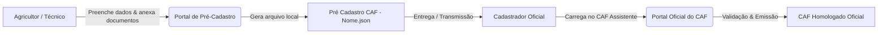

# 🌱 Sistema de Pré-Cadastro e Assistente Inteligente do CAF

Solução completa para coleta, validação prévia e automação no preenchimento do **Cadastro Nacional da Agricultura Familiar (CAF)**, composta por:
1. **Portal Web de Pré-Cadastro:** Formulário para agricultores e técnicos coletarem, conferirem e estruturarem as informações da Unidade Familiar de Produção Agrária (UFPA).
2. **CAF Assistente (Userscript Tampermonkey):** Painel inteligente para cadastradores oficiais automatizarem a inserção dos dados diretamente no sistema oficial do Governo Federal.

---

## 📌 Sobre o Projeto

O **Pré-Cadastro CAF** é uma aplicação de apoio e facilitação de atendimento. Ele permite que o agricultor ou técnico preencha antecipadamente todos os dados cadastrais da família, endereço, áreas exploradas, mão de obra e notas fiscais de comercialização da produção, gerando um arquivo estruturado em formato `.json` que pode ser facilmente importado e conferido pelo **cadastrador oficial**.

> [!IMPORTANT]
> **Natureza Preparatória:** O preenchimento deste formulário constitui exclusivamente uma etapa de pré-cadastro e coleta prévia de informações. Ele **não substitui, não homologa e não emite o CAF oficial**, que deve ser formalizado e homologado presencialmente por um cadastrador autorizado no sistema oficial do Governo Federal.

---

## 🚀 Como Funciona o Fluxo



1. **Preenchimento dos Dados:** O usuário insere as informações familiares, endereço da UFPA, dados da propriedade, coordenadas, mão de obra e notas fiscais de comercialização.
2. **Conferência e Declaração:** O usuário revisa as informações e confirma as declarações obrigatórias de veracidade (Art. 299 do Código Penal) e ciência sobre o tratamento e armazenamento dos dados.
3. **Geração do Arquivo Local (`.json`):** Ao clicar em **"Salvar como"**, o sistema gera um arquivo seguro no padrão `Pré Cadastro CAF - [Nome do Declarante].json` e realiza o download diretamente para o dispositivo.
4. **Atendimento Oficial:** O arquivo gerado é apresentado ao cadastrador oficial do CAF (ex: técnicos do Incaper, sindicatos ou entidades credenciadas) para conferência, validação e inserção no portal oficial.

---

## 🔒 Privacidade, Armazenamento Local e LGPD

* **Armazenamento 100% Local:** Todos os dados digitados e arquivos PDF anexados são processados e armazenados **inicialmente de forma local** no próprio navegador (`localStorage` do dispositivo).
* **Sem Servidores Externos:** A aplicação não realiza o envio automático de quaisquer informações ou documentos pessoais para bancos de dados ou servidores externos em nuvem.
* **Segurança do Arquivo:** O arquivo JSON resultante contém dados pessoais e documentos em formato Base64. Após o download, ele deve ser mantido em local seguro pelo responsável pelo atendimento, evitando cópia ou compartilhamento com pessoas não autorizadas.
* **LGPD (Lei nº 13.709/2018):** O tratamento das informações e documentos observa as finalidades legítimas de atendimento ao agricultor familiar e preparação para o CAF, respeitando a privacidade e os direitos dos titulares de dados.

---

## 📋 Estrutura dos Módulos do Formulário

* **1. Membros da Família:** Identificação do titular e dos demais integrantes da UFPA (CPF, Nascimento, Sexo, Identidade de Gênero, Estado Civil, Cor/Raça, Escolaridade, UF e Município de Nascimento, Parentesco, Trabalho na UFPA, Telefone e Documentos de Identidade).
* **2. Endereço da UFPA:** Localização do estabelecimento principal com busca automática por CEP (ViaCEP) e padronização oficial de UFs e Municípios.
* **3. Áreas e Imóveis Rurais:** Condição de posse, tipo de área, tamanho em hectares/m³, dados do proprietário (quando não for proprietário exclusivo), coordenadas geográficas e anexo de documento comprobatório em PDF.
* **4. Mão de Obra na UFPA:** Cadastro de trabalhadores contratados permanentes ou temporários (homem/dia).
* **5. Renda da Propriedade e Documentos Fiscais:** Upload de DANFEs em PDF, importação de chaves de acesso da NF-e e síntese dinâmica da produção comercializada com enquadramentos oficiais do CAF.
* **Declaração, Ciência e Proteção de Dados:** Termo de veracidade (Art. 299 CP) e ciência sobre o uso dos dados com modal de confirmação prévia ao salvamento.

---

## 🤖 Guia do Cadastrador: Como Utilizar o CAF Assistente

O **CAF Assistente** é um userscript executado diretamente no navegador pelo cadastrador oficial através da extensão **Tampermonkey**.

### 1. Instalar a Extensão Tampermonkey
Instale a extensão no seu navegador de preferência:
* [Tampermonkey para Google Chrome](https://chromewebstore.google.com/detail/tampermonkey/dhdgffkkebhmkfjojejmpbldmpobfkfo)
* [Tampermonkey para Microsoft Edge](https://microsoftedge.microsoft.com/addons/detail/tampermonkey/iikmkjmpaadaobahmlepeloendndfphd)
* [Tampermonkey para Mozilla Firefox](https://addons.mozilla.org/pt-BR/firefox/addon/tampermonkey/)

---

### 2. Instalar o Script do CAF Assistente

Escolha uma das opções abaixo para instalar o script no Tampermonkey:

#### ⚡ Opção 1: Instalação Automática via URL (Recomendado)

1. Copie a URL direta do script abaixo:
   ```text
   https://raw.githubusercontent.com/jvitoragr/CAF_pre_cadastro/refs/heads/main/CAF_Assistente_V1.1.js
   ```
2. No seu navegador, clique no ícone do **Tampermonkey** e abra o **Painel de Controle** (*Dashboard*).
3. Clique na aba **Utilitários** (*Utilities*).
4. Na seção **"Instalar de URL"** (*Install from URL*), cole o link copiado no campo de texto e clique no botão **Instalar**.
5. Na tela seguinte de confirmação do script, clique em **Instalar** (ou *Confirmar Instalação*).

---

#### 🛠️ Opção 2: Instalação Manual (Copiar e Colar)

1. Abra o arquivo [`CAF_Assistente_V1.1.js`](CAF_Assistente_V1.1.js) no repositório.
2. Clique no botão **Raw** (ou selecione e copie todo o código).
3. Abra o ícone do **Tampermonkey** no navegador e clique em **Criar novo script...** (ícone de **+**).
4. Apague qualquer código existente no editor, cole o código copiado e pressione `Ctrl + S` para salvar.

---

### 3. Acessar o Portal Oficial do CAF
Acesse o sistema oficial do CAF: [https://caf.mda.gov.br/](https://caf.mda.gov.br/).  
O assistente será exibido como um **painel inteligente flutuante** no canto inferior da tela.

---

### 4. Automação por Abas no Portal Oficial do CAF

Com os dados carregados no assistente (via arquivo JSON fornecido pelo agricultor ou via formulário integrado), utilize os comandos rápidos do painel em cada etapa:

* 👥 **Aba 1 (Pessoas / Membros):**
  * Preenchimento automático de CPF, consulta automática à Receita Federal, preenchimento de datas, estado civil, escolaridade, sexo, gênero, raça, dados de nascimento e documentos.
* 📍 **Aba 2 (Endereço da UFPA):**
  * Preenchimento de CEP, UF, Município, Logradouro, Bairro e marcação automática de "Sem número".
* 🏞️ **Aba 3 (Áreas e Imóveis Rurais):**
  * Preenche condição de posse, tipo de área, tamanho com formatação decimal precisa em hectares, dados de proprietários e anexa automaticamente o PDF comprobatório embutido.
* 🚜 **Aba 4 (Mão de Obra):**
  * Insere os trabalhadores contratados permanentes e temporários (homem/dia).
* 🌾 **Aba 5 (Renda e Produção):**
  * Preenchimento automático da grade de produtos, enquadramentos de renda e upload em lote de todas as notas fiscais comprobatórias.

---

> [!TIP]
> ### ⚡ Destaque: Uso SEM Arquivo JSON Prévio
> 
> O **CAF Assistente funciona perfeitamente mesmo se o agricultor não tiver realizado o pré-cadastro ou não possuir um arquivo JSON!**  
> No momento do cadastramento oficial presencial, caso o cadastrador precise apenas processar as notas fiscais da produção, calcular a renda anual e anexar os comprovantes:
> 
> 1. No painel flutuante do assistente dentro do portal do CAF, clique no botão **"Editar" / "Coleta de Dados"**.
> 2. A janela integrada de coleta de dados será aberta.
> 3. Vá direto na **Aba 5 (Renda e Produção)** e faça o upload em lote de todos os arquivos PDF de DANFEs ou cole as chaves de acesso / links das notas.
> 4. O sistema processa tudo na hora: extrai os produtos, calcula os totais e gera a síntese anual da produção com os devidos enquadramentos do CAF.
> 5. Clique em **"Salvar Edição"** na **parte inferior (rodapé) da janela**: todos os dados consolidados e os arquivos PDF são **injetados instantaneamente de volta no CAF Assistente**.
> 6. Retorne à aba do portal do CAF e utilize as automações do assistente para preencher toda a grade de renda e realizar o upload em lote dos PDFs das notas fiscais em poucos segundos!

---

## 🛠️ Tecnologias Utilizadas

* **HTML5 / CSS3 Moderno** (Interface responsiva e acessível)
* **JavaScript (Vanilla)** (Processamento client-side, manipulação de DOM e integração Tampermonkey)
* **[PDF.js](https://mozilla.github.io/pdf.js/)** (Leitura e extração local de dados de DANFEs em PDF)
* **[ViaCEP](https://viacep.com.br/)** (Consulta de endereços por CEP)
* **[Font Awesome](https://fontawesome.com/)** (Iconografia)

---

## 👨‍💻 Desenvolvedor e Idealização

* **Idealização e Desenvolvimento:** **João Vitor Toledo**  
  *Engenheiro Agrônomo, Mestre em Produção Vegetal, Doutor em Meteorologia Agrícola*  
  GitHub: [@jvitoragr](https://github.com/jvitoragr)
* **Auxílio de Inteligência Artificial & Engenharia de Software:**  
  *Desenvolvido com o suporte do modelo **Gemini 2.5 Flash** através da plataforma **Antigravity IDE**.*

---

## 📄 Licença

Este projeto é disponibilizado para fins de suporte, facilitação e atendimento à agricultura familiar.
